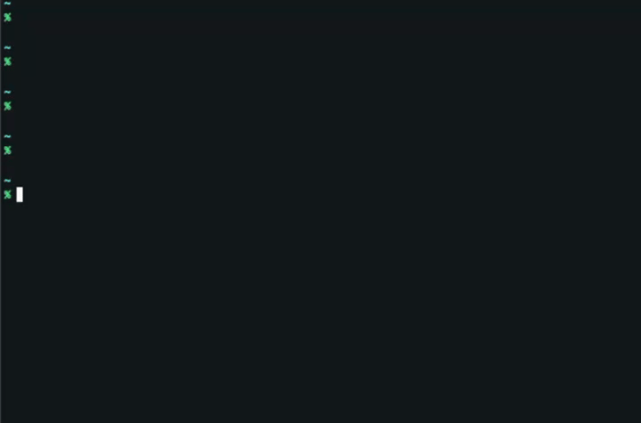
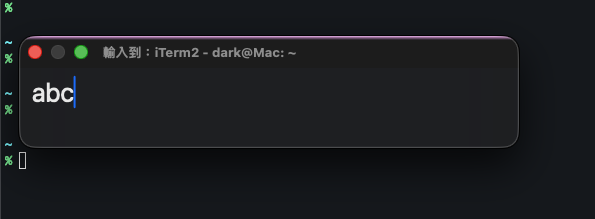
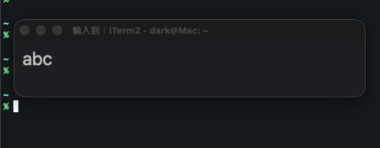
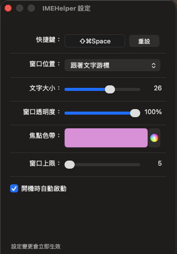
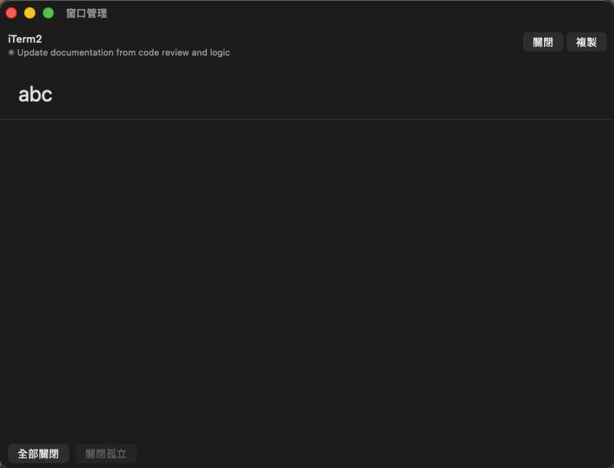

[English](README.md) | [繁體中文](README.zh-TW.md)

# IMEHelper

輕量級 macOS 工具，提供浮動輸入面板，讓你在任何 app 中使用中日韓等需要輸入法組字的語言，再將文字回填到原本的 app。

## 解決什麼問題

許多 macOS app 無法正確處理輸入法：

- **終端機**（iTerm2、Wezterm、Ghostty）— 透過 SSH 時中文輸入異常
- **遠端桌面**（RDP、VNC、Parsec）— 輸入法組字無法正常運作
- **Electron app**（ChatGPT、VS Code 終端）— 退格鍵刪錯字元、組字文字消失
- **其他 app** — 某些 app 根本不支援輸入法

這影響**中文、日文、韓文、越南文**等需要輸入法組字的語言使用者。

## 運作方式

1. 在任何 app 中按下全域快捷鍵（預設：`Cmd+Shift+Space`）
2. 浮動輸入面板出現 — 自由輸入，完整的輸入法支援
3. 按 `Enter` 將文字回填到原本的 app

每個視窗和分頁都有獨立的草稿，切換上下文不會遺失文字。

> 文字透過剪貼簿（Cmd+V）注入。原本的剪貼簿內容會自動備份並在注入後還原。

## 截圖

| 有焦點 | 無焦點 |
|--------|--------|
|  |  |

| 設定 | 視窗管理 |
|------|----------|
|  |  |

## 功能

- **浮動輸入面板** — 半透明玻璃效果
- **每個視窗/分頁獨立草稿** — 每個上下文保留自己的文字
- **智慧偵測** — 事件驅動的分頁/視窗變化偵測
- **自訂快捷鍵** — 設定你偏好的快捷鍵組合
- **視窗管理** — 檢視、複製、管理所有作用中的面板
- **焦點提示** — 上邊色帶 + 透明度變化顯示焦點狀態
- **可自訂** — 面板位置、字型大小、透明度、焦點色帶顏色
- **多語系** — 英文與繁體中文

## 受影響的語言

IMEHelper 幫助所有需要輸入法組字的語言使用者：

| 語言 | 常見問題 |
|------|---------|
| 中文 | 組字文字不可見、終端機中輸入法組字異常 |
| 日文 | 候選窗位置錯誤、按修飾鍵時組字文字消失 |
| 韓文 | 空白鍵雙倍輸入、組字過程文字不可見、快捷鍵被輸入法攔截 |
| 越南文 | Telex/VNI 組字過程字元遺失或重複 |

## 系統需求

- macOS 14.0（Sonoma）或更新版本
- 需要輔助使用權限（用於快捷鍵偵測和游標位置）

## 安裝

1. 從 [Releases](../../releases) 下載最新的 `.dmg`
2. 打開 DMG，將 `IMEHelper.app` 拖到應用程式資料夾
3. 啟動 IMEHelper — 它會以鍵盤圖示出現在選單列
4. 依提示授予輔助使用權限（系統設定 > 隱私權與安全性 > 輔助使用）

> **注意：** 由於 app 未經公證，首次啟動可能需要右鍵 > 打開。之後就能正常開啟。

## 使用方式

| 動作 | 操作 |
|------|------|
| 開啟輸入面板 | 按 `Cmd+Shift+Space`（或自訂快捷鍵） |
| 送出文字 | 按 `Enter` |
| 切換面板顯示 | 面板可見時再按一次快捷鍵 |
| 清空文字 | 按一次 `ESC` |
| 關閉面板 | 按兩次 `ESC`（空白時按一次即可） |
| 設定 | 點擊選單列圖示 > 設定 |
| 視窗管理 | 點擊選單列圖示 > 視窗管理 |

## 已知限制

- 文字注入使用剪貼簿（Cmd+V）。原本的剪貼簿內容會自動備份還原，但在短暫的注入期間，對剪貼簿敏感的 app 可能會受影響。
- 輸入面板需要輔助使用權限。某些企業管理的 Mac 可能會限制此權限。
- 分頁識別依賴 Accessibility API 屬性，不同 app 的支援程度不同。某些 app 可能無法在分頁層級區分。

## 從原始碼建置

1. Clone 此 repository
2. 用 Xcode 開啟 `IMEHelper.xcodeproj`
3. 建置並執行（需要 macOS 14.0+ SDK）

## 貢獻

歡迎提交 Issue 和 Pull Request。回報 bug 時請附上 macOS 版本和發生問題的 app。

## 授權

[MIT License](LICENSE)

*介面語言跟隨系統設定，支援英文與繁體中文。*
